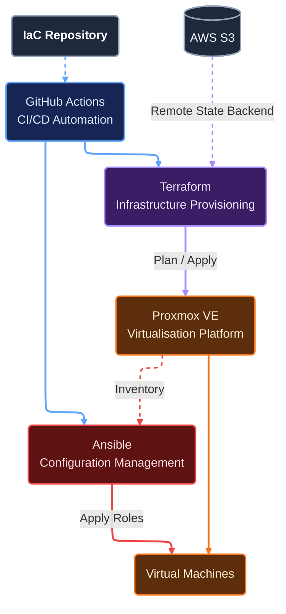

# Platform Automation
This Infrastructure as Code project builds an automation layer on top of Proxmox and is effectively the definition of the desired platform.

It provides the underlying services and automation capabilities required to bootstrap, automate the platform and operate workloads running on it.

## Overview


### Continuous Integration and Delivery
**GitHub Actions**<br>
It's used to gate and automate infrastructure changes. It's source is driven from the repository. 

The CI/CD invokes Terraform to provision infrastructure which is declared in `Environments`.

If required, Ansible is then called to manage the configuration of the infrastructure.

Additionally workflows provided
- Bootstrap AWS S3 storage
- Unlock Terraform State in S3

### Infrastructure Provisioning
**Terraform**<br>
Terraform plan safetly maps what's it's going to create, modify or destroy, in CI/CD this stage has read only access. 

Once the plan has been approved, the Terraform apply/destroy stage is provided write access.

For the backend, object storage such as AWS S3 is recommended. It has state locking support.

Modules
  - cloud-image
  - virtual-machine

### Virtualisation Platform
**Proxmox VE**<br>
This hypervisor provides APIs which are consumed by Terraform and Ansible to create and run Virtual Machines.

### Configuration Management 
**Ansible**<br>
Inventory is dynamically pulled from the Proxmox API. Roles are applied based on tags. If a node has the `managed` tag, they will have the managed ansible roles applied.

Ansible remotes to Virtual Machines with SSHs keys.

### Virtual Machines 
The virtual machines will host services and workloads, any flavour of Linux could work but currently AlmaLinux10 and Ubuntu configuration is supported.

- Services
    - vault
- Workloads
    - k3s

### VPN
**Wireguard**<br>
Connections to the Proxmox API is done securely over Wireguard. With this solution no runner is required in your environment.

## Environment Example
[./terraform/environments/dev/k3s/terraform.auto.tfvars](https://github.com/rauland/iac/blob/main/terraform/environments/dev/k3s/terraform.auto.tfvars)
```
vms = {                              # 1 or more VMs can be defined
  k3s-01 = {                         # name of guest
    node_name = "pve"                # name of pve node
    tags      = ["managed", "k3s"]   # managed for ansible configuration
    cpu       = 2
    memory    = 4096
  }
  k3s-02 = {
    node_name = "pve"
    tags      = ["managed", "k3s"]
    cpu       = 2
    memory    = 4096
  }
}
```

## Limitations
By the ephemeral nature of deployments, destroys and scaling. The assumption is that your infrastructure supports DHCP and dynamic DNS or that you're able to set static IPs.

## Planned Features
### Configuration Management
- K3s Roles
- SSH Certs
- Secrets Management
    - SOPS or Ansible-Vault

### CI/CD
- Linting
    - Terraform fmt

### K8s
- GitOps
- Backup persistent container data to cloud
 
## Future Features
- Static IPAM integration
