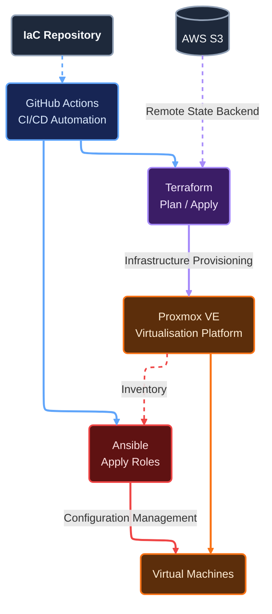

# Self-hosted Platform
This Infrastructure as Code project defines and automates the infrastructure and services that make up a self-hosted platform running on Proxmox. It provides the underlying compute, shared services and automation capabilities required to operate the platform and support workloads running on it.

### Technologies used
- Ansible roles and playbooks for configuration management of platform components.
- GitHub Actions workflows for continuous integration and deployment.
- Terraform modules for infrastructure provisioning of platform components.

## Overview


### Ansible Controller
Roles are applied based on tags provided by Terraform. If a node has the `managed` tag, they have the managed ansible roles applied.

### Actions Pipeline
Workflows bootstrap and call Terraform modules with infrastructure being declared in `Environments`.

Terraform plan has read only access. Terraform apply and destroy require pipeline approval for write access.

### Wireguard VPN
Connections to the Proxmox API is done securely over Wireguard. With this solution no runner is required in your environment.

## Environment Example
[./terraform/environments/dev/k3s.tfvars](https://github.com/rauland/iac/blob/main/terraform/environments/dev/k3s.tfvars)
```
vms = {                              # 1 or more VMs can be defined
  k3s-01 = {                         # name of guest
    node_name = "pve"                # name of pve node
    tags      = ["managed", "k3s"]   # managed for ansible configuration
    cpu       = 2
    memory    = 4096
  }
  k3s-02 = {
    node_name = "pve"
    tags      = ["managed", "k3s"]
    cpu       = 2
    memory    = 4096
  }
}
```

## Limitations
By the ephemeral nature of deployments, destroys and scaling. The assumption is that your infrastructure supports DHCP and dynamic DNS.

## Current Features
### Configuration Management
- Ansible Playbooks
    - Apply managed baseline
- Dynamic Inventory
    - Tag-based

### Infrastructure Provisioning
- Remote state locking backend on AWS S3
- Modules
  - cloud-image
  - virtual-machine
- Platform
  - vault
  - k3s

### CI/CD
- Ansible Controller
- Terraform Plan, Apply, Destroy
- Plan on PR
- Wireguard VPN
- AWS S3 Bucket Bootstrap
- Unlock State

## Planned Features
### Configuration Management
- K3s Roles
- SSH Certs
- Secrets Management
    - SOPS or Ansible-Vault

### CI/CD
- Linting
    - Terraform fmt

### K8s (May be in private repo)
- GitOps
- Backup persistent container data to cloud
 
## Future Features
- Static IPAM integration
